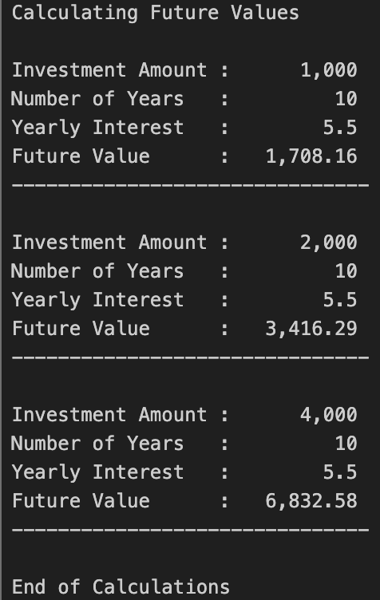

# COBOL CALC2000
___

## Overview
___
This COBOl program calculates future values for an investment, an doubles the investment amount twice.

## Table of Contents
___
* [New Concepts](#new-concepts)
* [Tech Stack](#tech-stack)
* [Installation](#installation)
* [Running Output](#running-output)
* [Learning Outcomes](#learning-outcomes)
* [Help](#help)
* [Authors](#authors)

## New Concepts
___
* Basic COBOL program structure (IDENTIFICATION, DATA, and PROCEDURE divisions)
* Working with numeric data types and variables
* Performing arithmetic operations (multiplication for investment growth)
* Using sequential calculations to update values step-by-step
* Output formatting using DISPLAY statements
* Understanding how legacy languages handle financial calculations

## Tech Stack
___
* 
* 
* 

## Installation
___
1. Clone the repository to your local machine. (or just steal my code)
2. Put the code into VS Code in your mainframe of choice

## Running Output
___

## Learning Outcomes
___
* Understand the foundational structure of a COBOL program
* Apply arithmetic operations to solve real-world financial problems
* Trace and debug sequential logic in a procedural language
* Gain exposure to legacy systems still used in banking and enterprise environments
* Develop confidence working outside languages like C++ or Java
* Recognize how simple programs model compound-style growth through repeated operations

## Help
___
* Make sure compiler is running correctly.
* Potentially re-clone repository
* restart IDE

## Author
___

**Clay Rasmussen**
* **Clay's GitHub Profile**: [Clay-Rasmussen](https://github.com/Clay-Rasmussen)
___
* **Clay's Email**: [Clrasm02@wsc.edu](mailto:clrasm02@wsc.edu)

[Back to the top](#overview)
